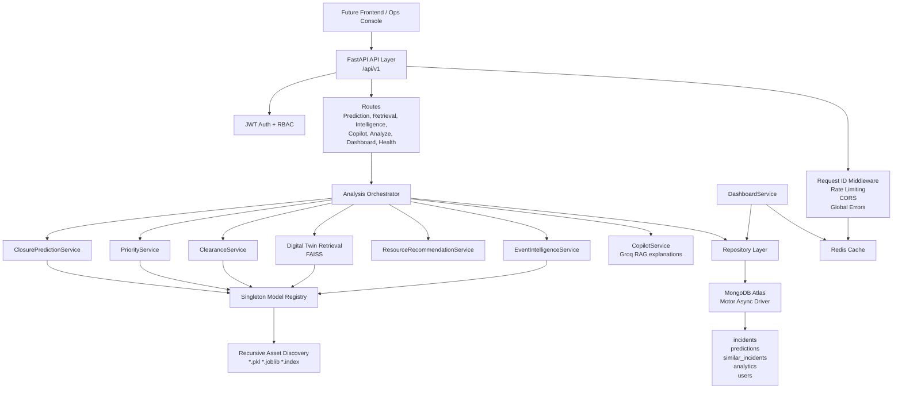
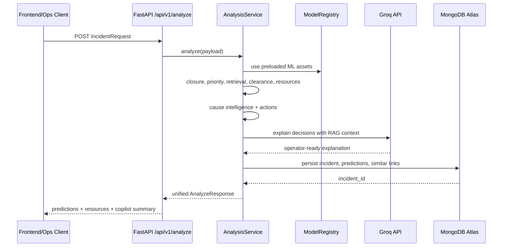

# GRIDLOCK Backend Architecture

```mermaid
flowchart TB
    Client["Future Frontend / Ops Console"] --> API["FastAPI API Layer\n/api/v1"]
    API --> Auth["JWT Auth + RBAC"]
    API --> Middleware["Request ID Middleware\nRate Limiting\nCORS\nGlobal Errors"]
    API --> Routes["Routes\nPrediction, Retrieval, Intelligence,\nCopilot, Analyze, Dashboard, Health"]

    Routes --> Analyze["Analysis Orchestrator"]
    Analyze --> Closure["ClosurePredictionService"]
    Analyze --> Priority["PriorityService"]
    Analyze --> Clearance["ClearanceService"]
    Analyze --> Retrieval["Digital Twin Retrieval\nFAISS"]
    Analyze --> Resource["ResourceRecommendationService"]
    Analyze --> Intel["EventIntelligenceService"]
    Analyze --> Copilot["CopilotService\nGroq RAG explanations"]

    Closure --> Registry["Singleton Model Registry"]
    Priority --> Registry
    Clearance --> Registry
    Retrieval --> Registry
    Intel --> Registry
    Registry --> Assets["Recursive Asset Discovery\n*.pkl *.joblib *.index"]

    Analyze --> Repos["Repository Layer"]
    Dashboard["DashboardService"] --> Repos
    Repos --> Mongo["MongoDB Atlas\nMotor Async Driver"]
    Dashboard --> Redis["Redis Cache"]
    Middleware --> Redis

    Mongo --> Collections["incidents\npredictions\nsimilar_incidents\nanalytics\nusers"]
```

```mermaid
sequenceDiagram
    participant UI as Frontend/Ops Client
    participant API as FastAPI /api/v1/analyze
    participant OR as AnalysisService
    participant MR as ModelRegistry
    participant G as Groq API
    participant DB as MongoDB Atlas

    UI->>API: POST IncidentRequest
    API->>OR: analyze(payload)
    OR->>MR: use preloaded ML assets
    OR->>OR: closure, priority, retrieval, clearance, resources
    OR->>OR: cause intelligence + actions
    OR->>G: explain decisions with RAG context
    G-->>OR: operator-ready explanation
    OR->>DB: persist incident, predictions, similar links
    DB-->>OR: incident_id
    OR-->>API: unified AnalyzeResponse
    API-->>UI: predictions + resources + copilot summary
```
