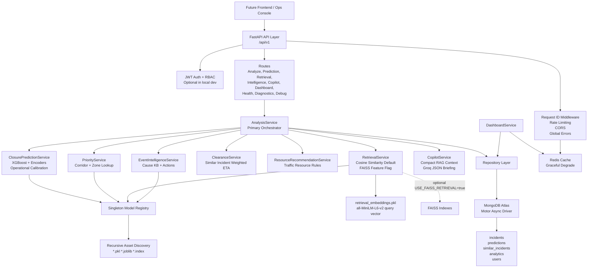
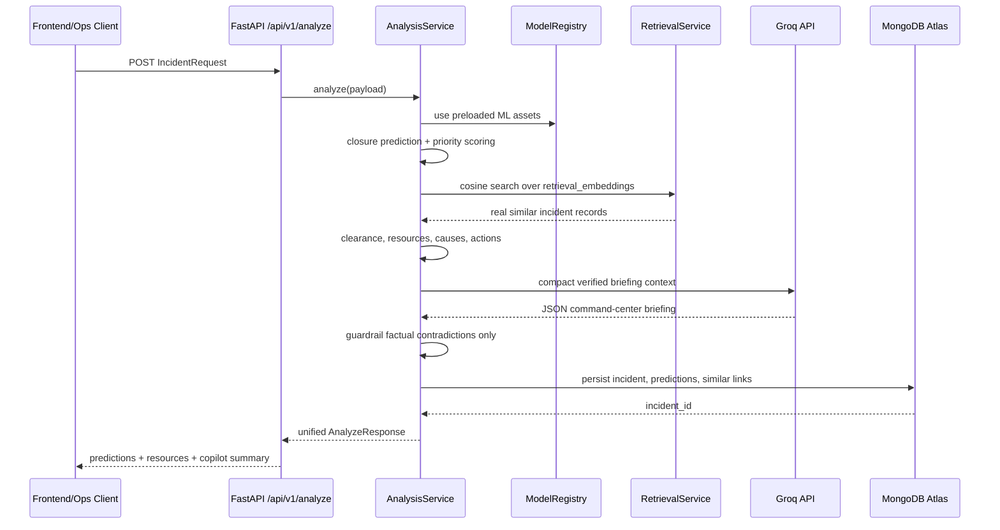

# GRIDLOCK Backend Architecture

```mermaid
flowchart TB
    Client["Future Frontend / Ops Console"] --> API["FastAPI API Layer<br/>/api/v1"]
    API --> Auth["JWT Auth + RBAC<br/>Optional in local dev"]
    API --> Middleware["Request ID Middleware<br/>Rate Limiting<br/>CORS<br/>Global Errors"]
    API --> Routes["Routes<br/>Analyze, Prediction, Retrieval,<br/>Intelligence, Copilot, Dashboard,<br/>Health, Diagnostics, Debug"]

    Routes --> Analyze["AnalysisService<br/>Primary Orchestrator"]
    Analyze --> Closure["ClosurePredictionService<br/>XGBoost + Encoders<br/>Operational Calibration"]
    Analyze --> Priority["PriorityService<br/>Corridor + Zone Lookup"]
    Analyze --> Retrieval["RetrievalService<br/>Cosine Similarity Default<br/>FAISS Feature Flag"]
    Analyze --> Clearance["ClearanceService<br/>Similar Incident Weighted ETA"]
    Analyze --> Resource["ResourceRecommendationService<br/>Traffic Resource Rules"]
    Analyze --> Intel["EventIntelligenceService<br/>Cause KB + Actions"]
    Analyze --> Copilot["CopilotService<br/>Compact RAG Context<br/>Groq JSON Briefing"]

    Closure --> Registry["Singleton Model Registry"]
    Priority --> Registry
    Retrieval --> Registry
    Intel --> Registry
    Registry --> Assets["Recursive Asset Discovery<br/>*.pkl *.joblib *.index"]

    Retrieval --> Embeddings["retrieval_embeddings.pkl<br/>all-MiniLM-L6-v2 query vector"]
    Retrieval -. "optional USE_FAISS_RETRIEVAL=true" .-> Faiss["FAISS Indexes"]

    Analyze --> Repos["Repository Layer"]
    Dashboard["DashboardService"] --> Repos
    Repos --> Mongo["MongoDB Atlas<br/>Motor Async Driver"]
    Dashboard --> Redis["Redis Cache<br/>Graceful Degrade"]
    Middleware --> Redis

    Mongo --> Collections["incidents<br/>predictions<br/>similar_incidents<br/>analytics<br/>users"]
```

```mermaid
sequenceDiagram
    participant UI as Frontend/Ops Client
    participant API as FastAPI /api/v1/analyze
    participant OR as AnalysisService
    participant MR as ModelRegistry
    participant R as RetrievalService
    participant G as Groq API
    participant DB as MongoDB Atlas

    UI->>API: POST IncidentRequest
    API->>OR: analyze(payload)
    OR->>MR: use preloaded ML assets
    OR->>OR: closure prediction + priority scoring
    OR->>R: cosine search over retrieval_embeddings
    R-->>OR: real similar incident records
    OR->>OR: clearance, resources, causes, actions
    OR->>G: compact verified briefing context
    G-->>OR: JSON command-center briefing
    OR->>OR: guardrail factual contradictions only
    OR->>DB: persist incident, predictions, similar links
    DB-->>OR: incident_id
    OR-->>API: unified AnalyzeResponse
    API-->>UI: predictions + resources + copilot summary
```
