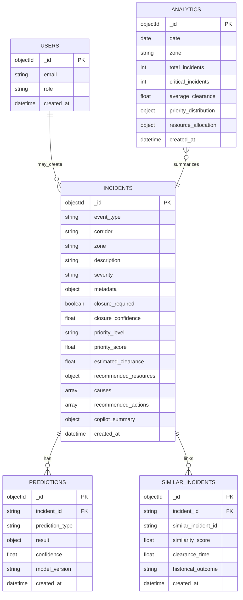

# GRIDLOCK MongoDB Collection Diagram

```mermaid
erDiagram
    USERS ||--o{ INCIDENTS : may_create
    INCIDENTS ||--o{ PREDICTIONS : has
    INCIDENTS ||--o{ SIMILAR_INCIDENTS : links
    ANALYTICS }o--|| INCIDENTS : summarizes

    USERS {
        objectId _id PK
        string email
        string role
        datetime created_at
    }

    INCIDENTS {
        objectId _id PK
        string event_type
        string corridor
        string zone
        string description
        string severity
        object metadata
        boolean closure_required
        float closure_confidence
        string priority_level
        float priority_score
        float estimated_clearance
        object recommended_resources
        array causes
        array recommended_actions
        object copilot_summary
        datetime created_at
    }

    PREDICTIONS {
        objectId _id PK
        string incident_id FK
        string prediction_type
        object result
        float confidence
        string model_version
        datetime created_at
    }

    SIMILAR_INCIDENTS {
        objectId _id PK
        string incident_id FK
        string similar_incident_id
        float similarity_score
        float clearance_time
        string historical_outcome
        datetime created_at
    }

    ANALYTICS {
        objectId _id PK
        date date
        string zone
        int total_incidents
        int critical_incidents
        float average_clearance
        object priority_distribution
        object resource_allocation
        datetime created_at
    }
```
