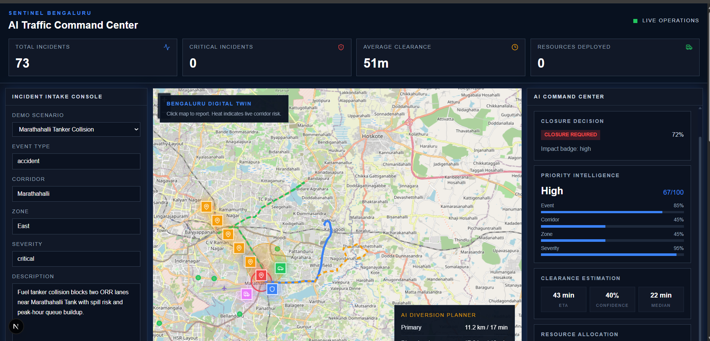
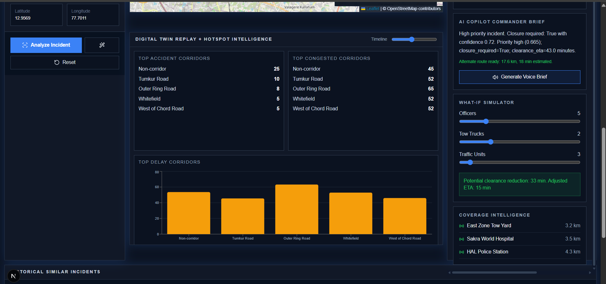
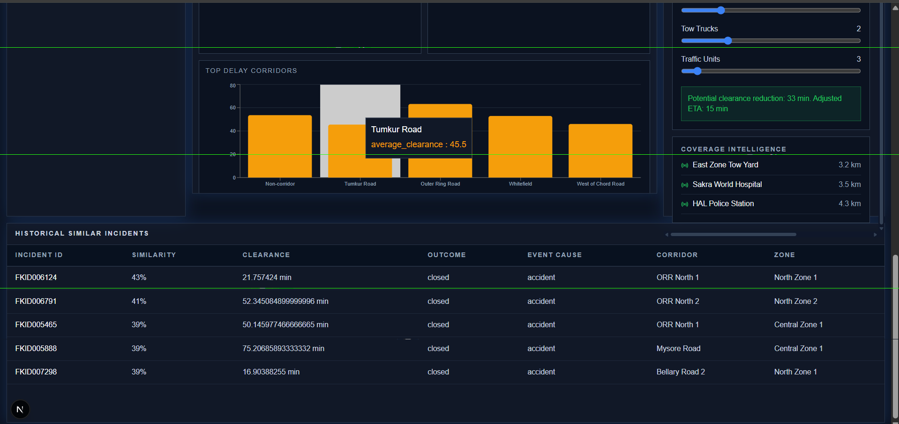
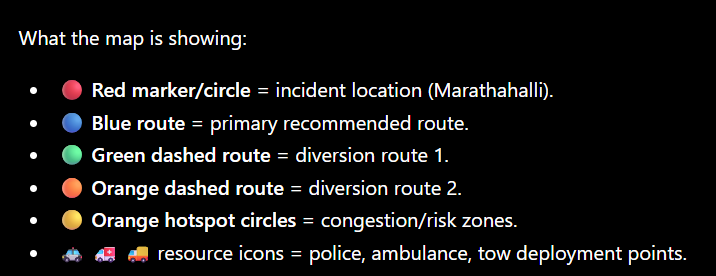

# 🚦 GRIDLOCK SENTINEL - AI Traffic Intelligence Command Center

An AI-powered Traffic Incident Intelligence Platform designed for real-time incident analysis, congestion prediction, resource allocation, route diversion planning, and digital twin visualization for smart city traffic management.

---

# 📌 Overview

GRIDLOCK SENTINEL provides traffic operators with an integrated command center that combines:

* AI Incident Analysis
* Priority Prediction
* Closure Intelligence
* Clearance Time Estimation
* Resource Allocation Planning
* Historical Incident Retrieval
* Digital Twin Traffic Visualization
* AI Copilot Decision Support
* Route Diversion Recommendations

The platform transforms raw incident reports into actionable operational intelligence.

---

# 🎯 Key Features

## Incident Intake Console

* Report traffic incidents
* Select operational scenarios
* Capture corridor, zone, severity, and location
* Interactive map-based reporting

## AI Command Center

* Closure Prediction
* Priority Scoring
* Similar Incident Retrieval
* Clearance Estimation
* Resource Recommendation
* AI Copilot Summary

## Digital Twin Visualization

* Live Incident Mapping
* Risk Heatmaps
* Historical Similar Incidents
* Coverage Intelligence
* Diversion Route Planning

## Dashboard Analytics

* KPI Monitoring
* Corridor Intelligence
* Zone Risk Monitoring
* Resource Availability Tracking

---

# 🏗️ System Architecture

```text
┌─────────────────────────────┐
│      Frontend (Next.js)     │
└──────────────┬──────────────┘
               │
               ▼
┌─────────────────────────────┐
│       FastAPI Backend       │
└──────────────┬──────────────┘
               │
    ┌──────────┼──────────┐
    ▼          ▼          ▼
 AI Models   MongoDB    OpenRouteService
    │                       │
    ▼                       ▼
Incident Analysis     Route Planning
Priority Engine       Diversions
Clearance Engine      Geocoding
```

---

# 🔄 AI Processing Pipeline

```text
Incident Report
       │
       ▼
Closure Prediction
       │
       ▼
Priority Analysis
       │
       ▼
Historical Retrieval
       │
       ▼
Clearance Estimation
       │
       ▼
Resource Allocation
       │
       ▼
AI Copilot Summary
       │
       ▼
Digital Twin Visualization
```

---

# 🗺️ Digital Twin Workflow

```text
User Reports Incident
         │
         ▼
Traffic Incident Created
         │
         ▼
AI Analysis Executed
         │
         ▼
Risk Zone Generated
         │
         ▼
Alternative Routes Computed
         │
         ▼
Command Center Updated
```

---

# 🧠 AI Modules

| Module           | Purpose                           |
| ---------------- | --------------------------------- |
| Closure AI       | Predict road closure requirements |
| Priority AI      | Estimate incident severity        |
| Retrieval Engine | Find similar historical incidents |
| Clearance AI     | Estimate clearance duration       |
| Resource AI      | Recommend response resources      |
| Copilot AI       | Generate operational brief        |

---

# 🛠️ Technology Stack

## Frontend

* Next.js 15
* React 19
* TypeScript
* Tailwind CSS
* Zustand
* TanStack Query
* Recharts
* React Leaflet
* Lucide Icons

## Backend

* FastAPI
* MongoDB Atlas
* Groq LLM
* OpenRouteService
* Redis (Optional)

## Mapping

* OpenStreetMap
* Leaflet
* OpenRouteService

---

# 📂 Project Structure

```text
frontend/
│
├── app/
├── components/
├── features/
│   ├── command-center/
│   ├── dashboard/
│   └── maps/
│
├── services/
│   ├── api.ts
│   ├── dashboard.ts
│   └── openrouteservice.ts
│
├── stores/
│   ├── dashboardStore.ts
│   ├── incidentStore.ts
│   └── mapStore.ts
│
├── hooks/
├── data/
├── types/
└── public/
```

---

# ⚙️ Environment Variables

Create a `.env` file:

```env
NEXT_PUBLIC_API_BASE_URL=http://localhost:8000
NEXT_PUBLIC_ORS_API_KEY=YOUR_ORS_KEY
```

---

# 🚀 Installation

## Install Dependencies

```bash
npm install
```

## Start Development Server

```bash
npm run dev
```

Application runs at:

```text
http://localhost:3000
```

---

# 📊 Screenshots

## Dashboard Overview

Place screenshot:

```text
docs/screenshots/dashboard-overview.png
```






map helper

# 📈 Performance Goals

* Real-Time Incident Analysis
* Sub-Second Dashboard Updates
* AI Assisted Decision Support
* Smart Resource Allocation
* Intelligent Route Diversions

---

# 🔮 Future Enhancements

* Live Traffic API Integration
* CCTV Computer Vision Module
* Predictive Congestion Forecasting
* Emergency Vehicle Routing
* Multi-City Deployment
* Mobile Field Operations App

---

# 👨‍💻 Team

GRIDLOCK Hackathon Team

AI Powered Traffic Intelligence & Smart Mobility Platform

---

# 📄 License

This project is developed for educational, research, and hackathon demonstration purposes.
